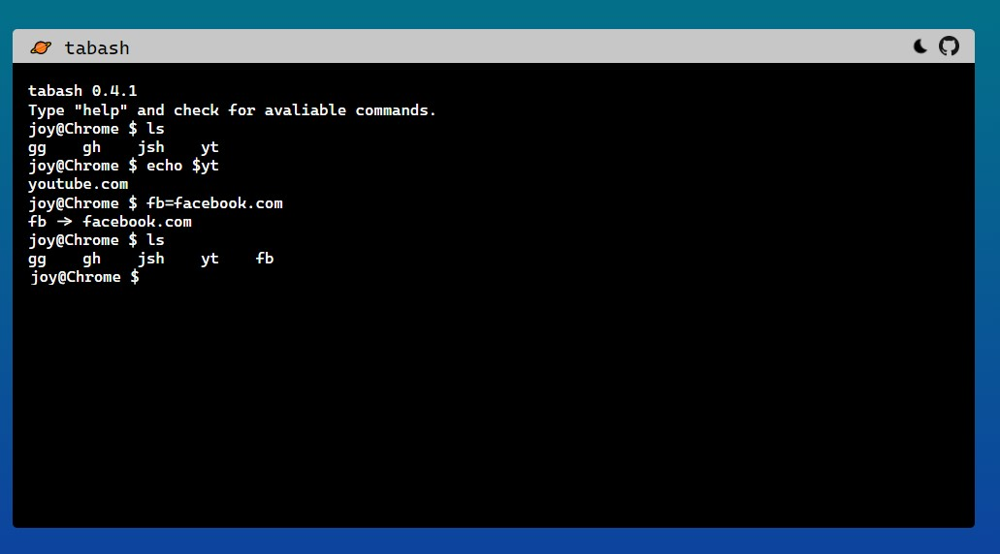

# tabash

tabash, a bash-like 'new tab' page for browser.

## Download
Since tabash does not follow Chrome Web Store's updated policy, you should download the source code and load it as an unpacked extension. Don't worry. It's easy.

## Setup

install packages

```Shell
yarn
```

start

```Shell
yarn start
```

build

```Shell
yarn build
```

load as an unpacked extension

```
Chrome > More tools > Extensions > Load unpacked > select the build directory
```
## Examples

> type "help" in tabash for more info

list registered links

```Shell
$ ls
```

register the link

```Shell
$ gh=github.com
```

open the link (github)

```Shell
$ gh
```

~~install a package from [tire](https://github.com/jshan2017/tire) (alarm, for example)~~
tire is deprecated since it's unavailable in Manifest V3

